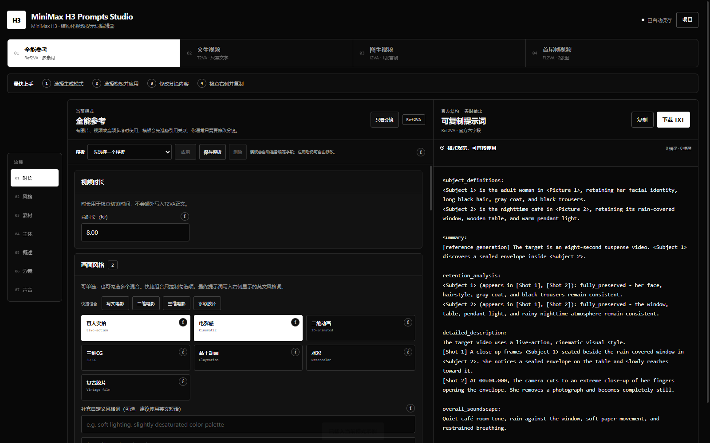

# MiniMax H3 Prompts Studio

[English](README_EN.md)

MiniMax H3 Prompts Studio 是一个在浏览器本地运行的视频提示词编辑工具，用来更直观地组织角色、参考素材、分镜、声音和提示词结构。

> 本项目是独立第三方工具，与 MiniMax 官方无关。

## 功能

- 支持全能参考、文生视频、图生视频和首尾帧视频四种模式
- 通过表单添加角色、图片、视频、音频和场景参考
- 为每个主体设置完整保留或部分保留，并补充保留要求
- 使用分镜卡片编排镜头、时间点、动作、运镜和台词
- 新增 Summary、Subject、Shot 或重置模式时自动提供规范英文起句
- 每个 Shot 内置可折叠镜头语言库，覆盖各种景别、视角、构图和运镜
- 通过台词插入器绑定 Subject、全局 Speaker 编号和语言标签
- 根据 Shot 正文中的引用一键同步 Subject 出现镜头
- 快速插入主体及参考素材引用，自动维护编号
- 提供多种提示词预设，支持组合预设和自定义预设
- 单独编辑环境声音与非画面音乐
- 使用声音快速库插入环境声、动作声、人物非语言声和非画面配乐
- 实时汇总完整提示词，并检查错误引用、Speaker 冲突、Retention、台词时长、时间顺序和声音字段
- 一键复制提示词或下载为 TXT 文件
- 支持工作区 JSON 导入、导出和浏览器本地保存
- 支持工作区级撤回与重做，以及 `Ctrl+Z`、`Ctrl+Shift+Z` / `Ctrl+Y` 快捷键
- 所有内容均在当前浏览器中处理，不会上传图片、视频或提示词

## 使用

1. 下载项目文件。
2. 双击 `index.html` 打开工具。
3. 选择生成模式，添加参考主体和分镜。
4. 根据需要应用预设并调整声音设置。
5. 检查生成结果，然后复制或下载提示词。

无需安装依赖，也无需部署服务器。
